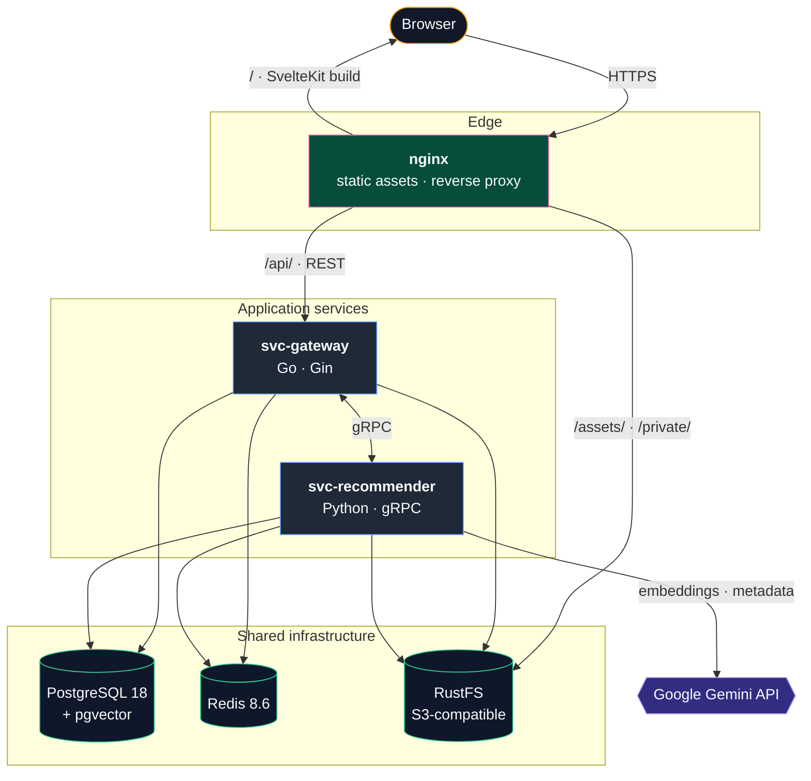

# sci-vault

[](LICENSE)
[](https://go.dev/)
[](https://www.python.org/)
[](https://svelte.dev/)
[](https://docs.docker.com/compose/)

AI-powered collaborative platform for research data management and discovery. Built on modern microservices architecture with gRPC communication, vector embeddings, and semantic search capabilities.

## Features

- **User Management** — Registration, authentication, email verification, password reset with rate limiting
- **Smart Recommendation Engine** — AI-powered document enrichment via Gemini API and vector embeddings
- **Vector Search** — pgvector-based semantic search across research documents
- **Modern UI** — SvelteKit 5 with Tailwind CSS v4, dark/light theme, multi-language support (EN/ZH-CN)
- **Microservices Architecture** — Scalable service design with gRPC inter-service communication
- **Cloud Storage** — S3-compatible object storage via RustFS
- **Caching & Rate Limiting** — Redis-backed rate limits and session management

## Architecture



## Tech Stack

| Component           | Technology                                                                                                                       |
| ------------------- | -------------------------------------------------------------------------------------------------------------------------------- |
| **API Gateway**     | [Go 1.26](https://go.dev/) · [Gin](https://gin-gonic.com/) · [GORM](https://gorm.io/)                                            |
| **Recommender**     | [Python 3.14](https://www.python.org/) · [gRPC](https://grpc.io/) · [Google Gemini API](https://ai.google.dev/)                  |
| **Frontend**        | [SvelteKit 2](https://kit.svelte.dev/) (Svelte 5) · [Tailwind CSS 4](https://tailwindcss.com/) · [Bits UI](https://bits-ui.com/) |
| **Database**        | [PostgreSQL 18](https://www.postgresql.org/) + [pgvector](https://github.com/pgvector/pgvector)                                  |
| **Cache**           | [Redis 8.6](https://redis.io/)                                                                                                   |
| **Storage**         | [RustFS](https://www.rustfs.io/) (S3-compatible)                                                                                 |
| **Code Generation** | [Buf](https://buf.build/) (Protocol Buffers)                                                                                     |

## Getting Started

### Prerequisites

**Option 1: Docker (Recommended)** — Simplest, all-in-one setup
- [Docker](https://docs.docker.com/get-docker/) with [Docker Compose](https://docs.docker.com/compose/install/)

**Option 2: Local Development** — Run services directly on your machine
- [Buf CLI](https://buf.build/docs/cli/installation/) — Required only when modifying `.proto` files
- [Go 1.26+](https://go.dev/doc/install)
- [Python 3.14+](https://www.python.org/downloads/) with [uv](https://docs.astral.sh/uv/getting-started/installation/)
- [Bun 1.0+](https://bun.sh/)

### Quick Start (Docker)

> **⚠️ Development Only:** The provided compose file and default configs are **for local development only**. For production, use hardened credentials and secrets management.

**1. Prepare configuration files:**

```bash
cp svc-gateway/config.docker.example.yaml svc-gateway/config.docker.yaml
cp svc-recommender/config.docker.example.yaml svc-recommender/config.docker.yaml
cp frontend/nginx.example.conf frontend/nginx.conf
```

**2. Update secrets in `svc-gateway/config.docker.yaml`:**

| Field                                       | Source                                                              |
| ------------------------------------------- | ------------------------------------------------------------------- |
| `database.password`                         | Must match `POSTGRES_PASSWORD` in `docker-compose.yaml`             |
| `storage.access_key` / `storage.secret_key` | Must match `RUSTFS_*` vars (default: `rustfsadmin` / `rustfsadmin`) |
| `mailer.username` / `mailer.password`       | Your SMTP credentials                                               |
| `jwt.secret`                                | Any strong random string                                            |

**3. Launch the stack:**

```bash
docker compose up -d --build
```

**4. Access the application:**

| Service        | Address                  | Notes                                                     |
| -------------- | ------------------------ | --------------------------------------------------------- |
| Frontend       | `http://<host>:80`/`443` | Only public-facing service; bound to all interfaces       |
| Gateway API    | `127.0.0.1:8080`         | Loopback-only; proxied by the frontend nginx              |
| RustFS Console | `127.0.0.1:9001`         | Loopback-only; admin UI                                   |
| RustFS S3 API  | `127.0.0.1:9000`         | Loopback-only; reached by services over compose network   |
| PostgreSQL     | `127.0.0.1:5432`         | Loopback-only; use host tooling like `psql` from the host |
| Redis          | `127.0.0.1:6379`         | Loopback-only                                             |

All infra and backend ports are bound to the loopback interface — inter-service traffic flows over the compose network by service name, and host tools (`psql`, `redis-cli`, `curl localhost:8080`) still work. To reach them from another machine, either tunnel over SSH or widen the binding in `docker-compose.yaml`.

**To stop:**
```bash
docker compose down
```

See [docker-compose.yaml](docker-compose.yaml) for detailed service configuration.

### Local Development

For developing individual services while keeping infrastructure in Docker:

**1. Start infrastructure only:**
```bash
docker compose up -d postgres redis rustfs rustfs-volume-helper
```

**2. Generate gRPC stubs (if you modified `.proto`):**
```bash
buf generate
```

**3. Run services individually** — see service-specific READMEs:

- **[svc-gateway](svc-gateway/README.md)** — REST API, authentication, document management
- **[svc-recommender](svc-recommender/README.md)** — Embedding generation, vector search, Gemini integration
- **[frontend](frontend/README.md)** — Web UI development guide

## Project Structure

```
sci-vault/
├── svc-gateway/              # Go API Gateway service
│   ├── internal/             # Business logic (handlers, services, repositories)
│   ├── pkg/                  # Shared packages (auth, storage, cache)
│   └── config.*.yaml         # Configuration templates
├── svc-recommender/          # Python gRPC recommender service
│   ├── src/
│   │   ├── servicer/         # gRPC service implementation
│   │   ├── genai/            # Gemini API integration
│   │   └── repository/       # Database access
│   └── pyproject.toml        # Python dependencies (uv)
├── frontend/                 # SvelteKit web application
│   ├── src/
│   │   ├── routes/           # Page routes
│   │   ├── lib/components/   # UI components (shadcn-svelte)
│   │   └── lib/api/          # API client
│   └── nginx.conf            # Production web server config
├── proto/                    # Protocol Buffer definitions
│   └── recommender/          # Recommender service specs
├── docker-compose.yaml       # Infrastructure services
├── buf.yaml & buf.gen.yaml   # Code generation config
└── README.md
```

## Development

### Common Commands

**Protocol Buffers** — Only run when modifying `.proto` files:
```bash
buf generate
```

**Gateway** — See [svc-gateway/README.md](svc-gateway/README.md):
```bash
cd svc-gateway
go run .             # Run
go test ./...        # Test
go vet ./...         # Lint
docker build .       # Build image
```

**Recommender** — See [svc-recommender/README.md](svc-recommender/README.md):
```bash
cd svc-recommender
uv sync              # Install deps
uv run main.py       # Run
uvx ruff check .     # Lint
docker build .       # Build image
```

**Frontend** — See [frontend/README.md](frontend/README.md):
```bash
cd frontend
bun install          # Install deps
bun run dev          # Dev server (localhost:5173)
bun run build        # Production build
bun run check        # Type & Svelte validation
bun run lint         # Format check
```

### Workflow Tips

1. **Configuration is runtime-mounted** — Edit `config.docker.yaml` and restart without rebuilding:
   ```bash
   docker compose restart gateway recommender
   ```

2. **Frontend nginx config** — Also mounted at runtime:
   ```bash
   # Edit frontend/nginx.conf, then:
   docker compose restart frontend
   ```

3. **HTTPS/TLS** — Place certs at `frontend/ssl/cert.pem` and `frontend/ssl/key.pem`, uncomment in `nginx.conf`, then restart.

## Production Deployment

> **⚠️ Do not deploy the default compose file to production.** `docker-compose.yaml` and the `config.docker.example.yaml` templates ship with development defaults (weak passwords, no TLS, unauthenticated Redis). Infrastructure and backend ports are already bound to loopback in the baseline compose, but the remaining hardening below is still required. Production deployments must use hardened copies with rotated secrets.

**1. Create a hardened compose file:**

```bash
cp docker-compose.yaml docker-compose-prod.yaml
```

The pattern `docker-compose-prod*.yaml` is listed in [.gitignore](.gitignore), so your production compose file (and any variants like `docker-compose-production.yaml`) will not be committed. Verify with `git status` before your first commit after copying.

**2. Harden the compose file and service configs:**

- Replace every default credential in `docker-compose-prod.yaml` (`POSTGRES_PASSWORD`, `RUSTFS_ACCESS_KEY`, `RUSTFS_SECRET_KEY`, etc.) with strong, unique secrets — ideally injected from a secrets manager or `.env` file rather than committed inline.
- Mirror the same secrets in `svc-gateway/config.docker.yaml` and `svc-recommender/config.docker.yaml` (both are gitignored per the service-level `.gitignore` files).
- Rotate `jwt.secret` to a fresh high-entropy value.
- Enable Redis authentication — add `--requirepass <strong-password>` to the `redis` service's `command`, and mirror the password in the gateway/recommender configs. The baseline compose leaves Redis unauthenticated (acceptable only because the port is loopback-only).
- Tighten `RUSTFS_CORS_ALLOWED_ORIGINS` / `RUSTFS_CONSOLE_CORS_ALLOWED_ORIGINS` to your actual frontend origin (e.g. `https://your-domain.example`) instead of the loopback defaults.
- Verify the loopback port bindings still match your topology. The baseline binds `postgres`, `redis`, `rustfs` (9000/9001), `recommender`, and `gateway` to `127.0.0.1` — appropriate when everything runs on one host behind the frontend nginx. If you split services across hosts, widen only the specific bindings needed and front them with a firewall or private network.
- Consider disabling the RustFS console (`RUSTFS_CONSOLE_ENABLE=false`) unless you actively need it.
- Configure TLS on the frontend: place certs at `frontend/ssl/cert.pem` / `frontend/ssl/key.pem` and enable the HTTPS server block in `nginx.conf`.

**3. Launch:**

```bash
docker compose -f docker-compose-prod.yaml up -d --build
```

**4. Verify nothing sensitive is tracked:**

```bash
git status --ignored
```

The hardened compose file and `config.docker.yaml` files should appear under *Ignored files*, never *Untracked* or *Changes*.

## Documentation

- **[Gateway API](svc-gateway/README.md)** — Endpoints, authentication, configuration
- **[Recommender Engine](svc-recommender/README.md)** — Gemini integration, embeddings, gRPC specs
- **[Frontend](frontend/README.md)** — UI components, SvelteKit setup, i18n

## License

This project is licensed under the [MIT License](LICENSE).

## Contributors

Thanks to all our contributors! View the [full contributor list](https://github.com/ZureTz/sci-vault/graphs/contributors).

<a href="https://github.com/ZureTz/sci-vault/graphs/contributors">
  
</a>